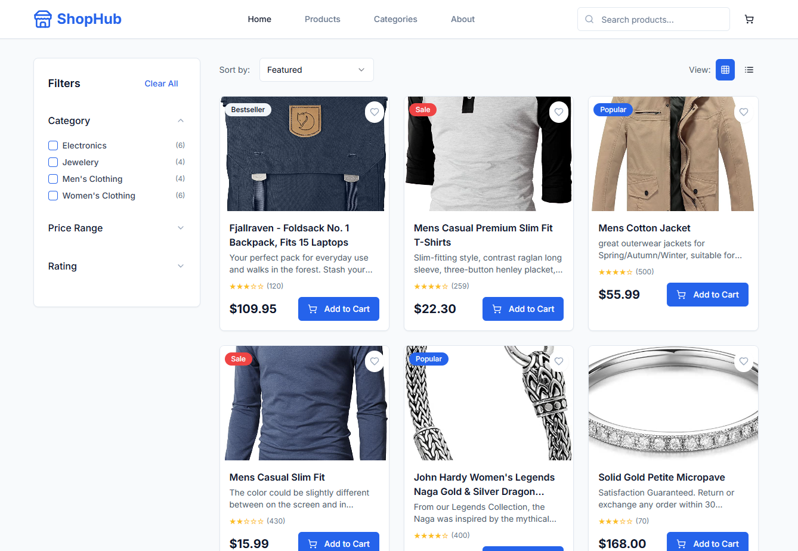

[Live Demo](https://suraj0004.github.io/react-ecommerce-ui/)

# ShopHub - Modern Product Showcase React App

A responsive React.js Product Showcase Web Application built with modern technologies, featuring advanced filtering, sorting, and PWA capabilities.

## Features

- **Modern React.js** with TypeScript and Vite
- **Responsive Design** with mobile-first approach using Tailwind CSS
- **Product Showcase** with cards displaying images, titles, prices, and ratings
- **Advanced Filtering** with collapsible sidebar (category, price range, rating)
- **Sorting Options** (price, name, rating, popularity)
- **Product Detail Pages** with full descriptions and image galleries
- **Shopping Cart** functionality with quantity management
- **Pagination** (10 products per page)
- **PWA Support** with service worker and offline capabilities
- **Real API Integration** using FakeStore API

## Tech Stack

- **Frontend**: React 18, TypeScript, Vite
- **Styling**: Tailwind CSS, shadcn/ui components
- **State Management**: React Query (TanStack Query), React hooks
- **Routing**: Wouter (lightweight client-side routing)
- **Icons**: Lucide React
- **API**: FakeStore API for product data

## Quick Start

### Prerequisites
- Node.js 18+ and npm

### Installation

1. Clone the repository:
```bash
git clone <repository-url>
cd shophub-react-app
```

2. Install dependencies:
```bash
npm install
```

3. Start the development server:
```bash
npm run dev
```

4. Open your browser and navigate to `http://localhost:5173`

### Available Scripts

- `npm run dev` - Start development server
- `npm run build` - Build for production
- `npm run preview` - Preview production build
- `npm start` - Serve production build

## Project Structure

```
src/
├── components/
│   ├── ui/          # Reusable UI components (shadcn/ui)
│   ├── filter-sidebar.tsx
│   ├── header.tsx
│   ├── product-card.tsx
│   ├── product-grid.tsx
│   └── pagination.tsx
├── hooks/
│   ├── use-cart.ts
│   ├── use-products.ts
│   └── use-toast.ts
├── lib/
│   ├── queryClient.ts
│   └── utils.ts
├── pages/
│   ├── home.tsx
│   ├── product-detail.tsx
│   ├── cart.tsx
│   └── not-found.tsx
├── types/
│   └── product.ts
├── App.tsx
├── main.tsx
└── index.css
```

## Features Overview

### Homepage
- Clean header with logo and navigation
- Search functionality
- Product cards grid with responsive layout
- Collapsible filter sidebar
- Sorting dropdown
- Pagination controls

### Product Detail Page
- Large product images with thumbnail gallery
- Complete product information
- Quantity selector
- Add to cart functionality
- Product features list

### Shopping Cart
- Item list with quantity controls
- Price calculations
- Responsive cart sidebar
- Checkout functionality (UI only)

### PWA Features
- Offline support with service worker
- App manifest for installation
- Caching strategies for better performance
- Push notification support (ready for implementation)

## API Integration

The app integrates with [FakeStore API](https://fakestoreapi.com) for:
- Product listings
- Product details
- Category filtering
- Real product data with images, prices, and ratings

## Responsive Design

- **Mobile-first** approach with Tailwind CSS
- **Breakpoints**: sm (640px), md (768px), lg (1024px), xl (1280px)
- **Grid layouts** that adapt to screen size
- **Touch-friendly** interface elements
- **Accessible** components with proper ARIA labels

## Browser Support

- Chrome 90+
- Firefox 88+
- Safari 14+
- Edge 90+

## Performance Optimizations

- **Code splitting** with dynamic imports
- **Image optimization** with lazy loading
- **API caching** with React Query
- **Service worker** for offline functionality
- **Bundle optimization** with Vite

## Contributing

1. Fork the repository
2. Create a feature branch
3. Make your changes
4. Add tests if applicable
5. Submit a pull request

## License

MIT License - feel free to use this project for learning or commercial purposes.

## Assignment Compliance

This project fulfills all requirements of the Frontend Developer Assignment:

✅ **Tech Stack**: React.js, Tailwind CSS, TypeScript
✅ **Responsive Design**: Mobile-first with PWA principles
✅ **Features**: Product cards, filtering, sorting, pagination
✅ **API Integration**: FakeStore API
✅ **Code Quality**: Clean, modular, well-commented code
✅ **Modern Practices**: Hooks, TypeScript, component reusability

## Screenshots

The application provides a modern, professional e-commerce experience with:
- Clean product grid layout
- Intuitive filtering system
- Smooth navigation between pages
- Responsive design for all devices
- Professional UI with attention to detail